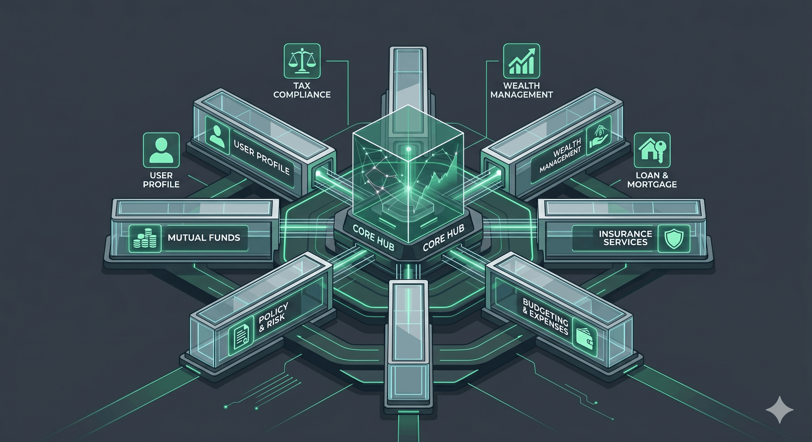
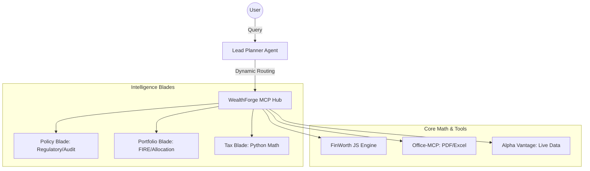

# WealthForge AI 🚀



**WealthForge AI** is a technical framework for building an **agentic personal finance workforce**. It serves as an architectural showcase for orchestrating multi-agent systems using the **Model Context Protocol (MCP)**, specifically tailored for the Indian and US financial landscapes.

[**🌐 Live Presentation Site**](https://vikisingh23.github.io/wealth-forge-ai/)

> **⚠️ DISCLOSURE & LIMITATIONS**: This project is for **educational and research purposes only**. It is not a financial advisory service. AI models can hallucinate; always verify calculations and advice with a registered Chartered Accountant (CA) or Certified Financial Planner (CFP). This system does not possess a fiduciary license.

---

## 🏛️ System Architecture

WealthForge AI utilizes a **"Hub & Blade"** orchestration model. This ensures a single entry point for all specialized financial intelligence.



---

## 💎 Architectural Highlights

- **Unified MCP Hub**: A centralized orchestration layer that manages specialized logic modules ("Blades").
- **Tool-Augmented Math**: Mitigates "AI math drift" by delegating all financial formulas to the [finworth-js](https://github.com/vikisingh23/finworth-js) math engine.
- **Context-Injected Personas**: Cross-platform configuration files (`.cursorrules`, `.kirorules`, `CLAUDE.md`) that ensure consistent agent behavior across IDEs and CLIs.
- **Privacy-First Design**: Prompt-level PII masking guidelines to ensure sensitive data (PAN, SSN) is not transmitted to LLM providers.

---

## 👥 The Agentic Research Workforce

These agents are designed to simulate specialized financial reasoning paths:
- **Lead Planner**: Synthesizes multi-agent data into a cohesive analytical roadmap.
- **Tax Strategist**: Simulates tax logic for the FY 2026-25 Indian Finance Act.
- **Loan Specialist**: Analyzes debt structures (RLLR vs MCLR) and prepayment math.
- **Policy Analyst**: Extracts and audits terms from insurance benefit illustrations.
- **MF Specialist**: Analyzes portfolio overlap and risk-adjusted return metrics.

---

## 🛠️ Integrated Tech Stack

- **Framework**: Model Context Protocol (MCP) for tool-to-model connectivity.
- **Master Hub**: `mcp/hub.mjs` (Dynamic tool routing and namespacing).
- **Math Engine**: `finworth-js` (Deterministic local calculations).
- **Automation**: `setup.mjs` (One-command environment initialization).

---

## 🚀 Quick Start (Efficient Usage)

### 1. Installation
```bash
git clone https://github.com/vikisingh23/wealth-forge-ai.git
cd wealth-forge-ai
npm run setup
```

### 2. Connect Your AI
Open the project in **Cursor**, **Kiro CLI**, or **Claude Code**. The framework will automatically inject the "WealthForge" persona and toolset into the session.

### 3. Example Execution
To use the framework efficiently, provide your core profile in the first prompt:
> *"I am 30, living in Mumbai, earning ₹25L base. Using the WealthForge framework, audit my ₹10k monthly LIC policy (PDF attached) and suggest a tax-efficient retirement path."*

---

## 📈 Example Workflows
For detailed walkthroughs on **Tax Optimization**, **FIRE Planning**, and **Insurance Auditing**, see [WORKFLOWS.md](./docs/WORKFLOWS.md).

## 🛡️ Security & Integrity
- **Local-First**: The `finworth` engine runs locally to keep financial math on-device.
- **Extensible**: Designed to allow developers to drop in new "Blades" for different jurisdictions or asset classes.

## 📄 License
MIT License. Created by [Vikas Singh](https://github.com/vikisingh23).
